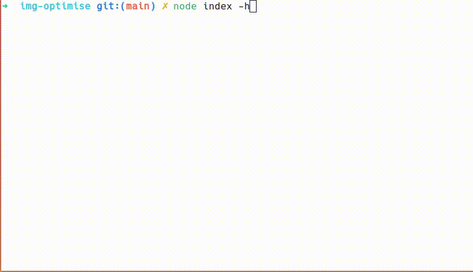

# Image Optimiser

A Node.js CLI application that optimises (~40% reduced file size) all the images in a specified directory. The application accepts an input path and an optional output path. If the output path is not provided, it writes the optimised images to the new output path (Creates new directory for output).

## Demo



## Usage/Examples

Usage: 
```sh
node index [options] <dir>
```

Options:
```sh
  -h, --help           # Display help information
  -s, --source-dir     # Source directory
  -d, --destin-dir     # Destination directory
```
Examples:
```sh
  node index -s imgs -d img_opti   # Optimize images from "imgs" to "imgs_opti" directory
  node index -s imgs   # Optimize images from "images" to new "imgs_optimised" directory
```
## Run Locally

Clone the project

```bash
git clone https://github.com/parthvyas7/img-optimise.git
```

Go to the project directory

```bash
cd img-optimise
```

Install dependencies

```bash
npm install
```


## License

[MIT](https://choosealicense.com/licenses/mit/)

